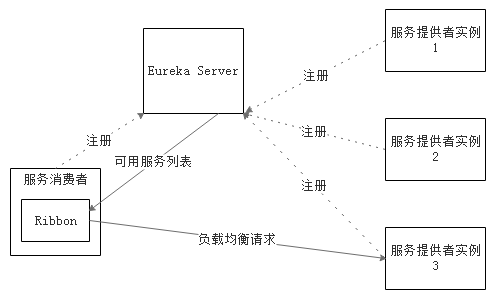

## Spring Cloud 项目架构

Spring Cloud是一系列框架的有序集合。它利用Spring Boot的开发便利性巧妙地简化了分布式系统基础设施的开发，
如服务发现注册、配置中心、消息总线、负载均衡、断路器、数据监控等，都可以用Spring Boot的开发风格做到一键启动和部署。
Spring并没有重复制造轮子，它只是将目前各家公司开发的比较成熟、经得起实际考验的服务框架组合起来，通过Spring Boot
风格进行再封装屏蔽掉了复杂的配置和实现原理，最终给开发者留出了一套简单易懂、易部署和易维护的分布式系统开发工具包。

> **核心成员**

- **Netflix Eureka**：服务中心，云端服务发现，一个基于 REST 的服务，用于定位服务，以实现云端中间层服务发现和故障转移。

- **Netflix Hystrix**：熔断器，容错管理工具，旨在通过熔断机制控制服务和第三方库的节点,从而对延迟和故障提供更强大的容错能力。

- **Netflix Zuul**：Zuul 是在云平台上提供动态路由,监控,弹性,安全等边缘服务的框架。

- **Netflix Archaius**：配置管理API，包含一系列配置管理API，提供动态类型化属性、线程安全配置操作、轮询框架、回调机制等功能。
可以实现动态获取配置， 原理是每隔60s（默认，可配置）从配置源读取一次内容，这样修改了配置文件后不需要重启服务就可以使修改后的内容生效，
前提使用archaius的API来读取。

- **Spring Cloud Config**：俗称的配置中心，配置管理工具包，让你可以把配置放到远程服务器，集中化管理集群配置，目前支持本地存储、
Git以及Subversion。

- **Spring Cloud Bus**：事件、消息总线，用于在集群（例如，配置变化事件）中传播状态变化，可与Spring Cloud Config联合实现热部署。

- **Spring Cloud Cluster**：Spring Cloud Cluster将取代Spring Integration。提供在分布式系统中的集群所需要的基础功能支持，
如：选举、集群的状态一致性、全局锁、tokens等常见状态模式的抽象和实现。


### Eureka

> Eureka 是一个基于 REST 的服务，主要在 AWS 云中使用, 定位服务来进行中间层服务器的负载均衡和故障转移。

Spring Cloud 封装了 Netflix 公司开发的 Eureka 模块来实现服务注册和发现。Eureka 采用了 C-S 的设计架构。Eureka Server 作为服务
注册功能的服务器，它是服务注册中心。而系统中的其他微服务，使用 Eureka 的客户端连接到 Eureka Server，并维持心跳连接。这样系统的维护
人员就可以通过 Eureka Server 来监控系统中各个微服务是否正常运行。Spring Cloud 的一些其他模块（比如Zuul）就可以通过 Eureka Server
来发现系统中的其他微服务，并执行相关的逻辑。

Eureka由两个组件组成：Eureka服务器和Eureka客户端。Eureka服务器用作服务注册服务器。Eureka客户端是一个java客户端，用来简化与服务器
的交互、作为轮询负载均衡器，并提供服务的故障切换支持。Netflix在其生产环境中使用的是另外的客户端，它提供基于流量、资源利用率以及出错
状态的加权负载均衡。


1、Eureka Server

- 提供服务注册和发现

2、Service Provider

- 服务提供方：将自身服务注册到Eureka，从而使服务消费方能够找到

3、Service Consumer

- 服务消费方：从Eureka获取注册服务列表，从而能够消费服务


### Feign

Feign是Netflix开发的声明式、模板化的HTTP客户端， Feign可以帮助我们更快捷、优雅地调用HTTP API。

Spring Cloud对Feign进行了增强，使Feign支持了Spring MVC注解，并整合了Ribbon和Eureka，从而让Feign的使用更加方便。

Spring Cloud Feign是基于Netflix feign实现，整合了Spring Cloud Ribbon和Spring Cloud Hystrix，除了提供这两者的强大功能外，
还提供了一种声明式的Web服务客户端定义的方式。

Spring Cloud Feign帮助我们定义和实现依赖服务接口的定义。在Spring Cloud feign的实现下，只需要创建一个接口并用注解方式配置它，
即可完成服务提供方的接口绑定，简化了在使用Spring Cloud Ribbon时自行封装服务调用客户端的开发量。

Spring Cloud Feign具备可插拔的注解支持，支持Feign注解、JAX-RS注解和Spring MVC的注解。


### Ribbon

Ribbon是Netflix发布的云中间层服务开源项目，其主要功能是提供`客户端`实现负载均衡算法。Ribbon客户端组件提供一系列完善的配置项如连接超时，
重试等。简单的说，Ribbon是一个客户端负载均衡器，我们可以在配置文件中Load Balancer后面的所有机器，Ribbon会自动的帮助你基于某种规则
（如简单轮询，随机连接等）去连接这些机器，我们也很容易使用Ribbon实现自定义的负载均衡算法



Ribbon工作时分为两步：

- 第一步选择Eureka Server，它优先选择在同一个Zone且负载较少的Server；

- 第二步再根据用户指定的策略，再从Server取到的服务注册列表中选择一个地址。其中Ribbon提供了很多策略，例如轮询round robin、随机Random、
根据响应时间加权等。


### Hystrix

Netflix Hystrix是SOA/微服务架构中提供服务隔离、熔断、降级机制的工具/框架。

#### Hystrix特性

- 1.断路器机制

断路器很好理解, 当Hystrix Command请求后端服务失败数量超过一定比例(默认50%), 断路器会切换到开路状态(Open). 这时所有请求会直接失败而
不会发送到后端服务. 断路器保持在开路状态一段时间后(默认5秒), 自动切换到半开路状态(HALF-OPEN). 这时会判断下一次请求的返回情况, 如果
请求成功, 断路器切回闭路状态(CLOSED), 否则重新切换到开路状态(OPEN). Hystrix的断路器就像我们家庭电路中的保险丝, 一旦后端服务不可用, 
断路器会直接切断请求链, 避免发送大量无效请求影响系统吞吐量, 并且断路器有自我检测并恢复的能力.

- 2.Fallback

Fallback相当于是降级操作. 对于查询操作, 我们可以实现一个fallback方法, 当请求后端服务出现异常的时候, 可以使用fallback方法返回的值. 
fallback方法的返回值一般是设置的默认值或者来自缓存.

- 3.资源隔离

在Hystrix中, 主要通过线程池来实现资源隔离. 通常在使用的时候我们会根据调用的远程服务划分出多个线程池. 例如调用产品服务的Command放入
A线程池, 调用账户服务的Command放入B线程池. 这样做的主要优点是运行环境被隔离开了. 这样就算调用服务的代码存在bug或者由于其他原因导致
自己所在线程池被耗尽时, 不会对系统的其他服务造成影响. 但是带来的代价就是维护多个线程池会对系统带来额外的性能开销. 如果是对性能有严格
要求而且确信自己调用服务的客户端代码不会出问题的话, 可以使用Hystrix的信号模式(Semaphores)来隔离资源.

#### 使用流程

因为熔断只是作用在服务调用这一端，因此只需要改动spring-cloud-consumer项目相关代码就可以。

**1、配置文件**

application.properties添加这一条：

```properties
feign.hystrix.enabled=true
```

**2、创建回调类**

创建 ScSysUserServiceFallback 类继承 IScSysUserService 类实现回调的方法

**3、添加fallback属性**

在 IScSysUserService 类添加指定fallback类，在服务熔断的时候返回fallback类中的内容。

#### Hystrix-dashboard

Hystrix-dashboard是一款针对Hystrix进行实时监控的工具，通过Hystrix Dashboard我们可以在直观地看到各Hystrix Command的请求响应时间, 
请求成功率等数据。但是只使用Hystrix Dashboard的话, 你只能看到单个应用内的服务信息, 这明显不够. 我们需要一个工具能让我们汇总系统内多
个服务的数据并显示到Hystrix Dashboard上, 这个工具就是Turbine.


### Spring Cloud Config

**配置中心提供的核心功能**：

- 提供服务端和客户端支持
- 集中管理各环境的配置文件
- 配置文件修改之后，可以快速的生效
- 可以进行版本管理
- 支持大的并发查询
- 支持各种语言

Spring Cloud Config项目是一个解决分布式系统的配置管理方案。它包含了Client和Server两个部分，server提供配置文件的存储、以接口的形式
将配置文件的内容提供出去，client通过接口获取数据、并依据此数据初始化自己的应用。Spring cloud使用git或svn存放配置文件。


**refresh**：

Spring Cloud Config分服务端和客户端，服务端负责将git（svn）中存储的配置文件发布成REST接口，客户端可以从服务端REST接口获取配置。但
客户端并不能主动感知到配置的变化，从而主动去获取新的配置。客户端如何去主动获取新的配置信息呢，springcloud已经给我们提供了解决方案，每
个客户端通过POST方法触发各自的/refresh。


### Spring cloud bus

Spring cloud bus通过轻量消息代理连接各个分布的节点。这会用在广播状态的变化（例如配置变化）或者其他的消息指令。Spring bus的一个核心
思想是通过分布式的启动器对spring boot应用进行扩展，也可以用来建立一个多个应用之间的通信频道。目前唯一实现的方式是用AMQP消息代理作为
通道，同样特性的设置（有些取决于通道的设置）在更多通道的文档中。


利用Spring Cloud Bus做配置更新的步骤:

- 1、提交代码触发post给客户端A发送bus/refresh
- 2、客户端A接收到请求从Server端更新配置并且发送给Spring Cloud Bus
- 3、Spring Cloud bus接到消息并通知给其它客户端
- 4、其它客户端接收到通知，请求Server端获取最新配置
- 5、全部客户端均获取到最新的配置


### Zuul

在微服务架构中，后端服务往往不直接开放给调用端，而是通过一个API网关根据请求的url，路由到相应的服务。当添加API网关后，在第三方调用端
和服务提供方之间就创建了一面墙，这面墙直接与调用方通信进行权限控制，后将请求均衡分发给后台服务端。

Spring Cloud Zuul路由是微服务架构的不可或缺的一部分，提供动态路由，监控，弹性，安全等的边缘服务。Zuul是Netflix出品的一个基于JVM
路由和服务端的负载均衡器。

**API Gateway的作用**：

- 1、简化客户端调用复杂度

在微服务架构模式下后端服务的实例数一般是动态的，对于客户端而言很难发现动态改变的服务实例的访问地址信息。因此在基于微服务的项目中为了
简化前端的调用逻辑，通常会引入API Gateway作为轻量级网关，同时API Gateway中也会实现相关的认证逻辑从而简化内部服务之间相互调用的复杂度。

- 2、数据裁剪以及聚合

通常而言不同的客户端对于显示时对于数据的需求是不一致的，比如手机端或者Web端又或者在低延迟的网络环境或者高延迟的网络环境。

因此为了优化客户端的使用体验，API Gateway可以对通用性的响应数据进行裁剪以适应不同客户端的使用需求。同时还可以将多个API调用逻辑进行
聚合，从而减少客户端的请求数，优化客户端用户体验

- 3、多渠道支持

当然我们还可以针对不同的渠道和客户端提供不同的API Gateway,对于该模式的使用由另外一个大家熟知的方式叫Backend for front-end, 在
Backend for front-end模式当中，我们可以针对不同的客户端分别创建其BFF。

进一步了解BFF可以参考这篇文章：[Pattern: Backends For Frontends](http://samnewman.io/patterns/architectural/bff/)


- 4、遗留系统的微服务化改造

对于系统而言进行微服务改造通常是由于原有的系统存在或多或少的问题，比如技术债务，代码质量，可维护性，可扩展性等等。API Gateway的模式
同样适用于这一类遗留系统的改造，通过微服务化的改造逐步实现对原有系统中的问题的修复，从而提升对于原有业务响应力的提升。通过引入抽象层，
逐步使用新的实现替换旧的实现。

#### zuul路由配置

**1.通过url映射的方式**:

```properties
zuul.routes.hello.path=/hello/**
zuul.routes.hello.url=http://localhost:9000/
```

访问地址：http://localhost:8888/hello/hello?name=dazuo

**2.服务化配置**：

```properties
zuul.routes.api-a.path=/producer/**
zuul.routes.api-a.serviceId=spring-cloud-producer
```

访问地址：http://localhost:8888/producer/hello?name=dazuo

**3.网关的默认路由规则**：

但是如果后端服务多达十几个的时候，每一个都这样配置也挺麻烦的，spring cloud zuul已经帮我们做了默认配置。默认情况下，Zuul会代理所有
注册到Eureka Server的微服务，并且Zuul的路由规则如下：http://ZUUL_HOST:ZUUL_PORT/微服务在Eureka上的serviceId/**会被转发到
serviceId对应的微服务。

访问地址：http://localhost:8888/spring-cloud-producer/hello

#### Zuul的核心

Zuul网关使用模式，以及自动转发机制，但其实Zuul还有更多的应用场景，比如：鉴权、流量转发、请求统计等等，这些功能都可以使用Zuul来实现。

Filter是Zuul的核心，用来实现对外服务的控制。Filter的生命周期有4个，分别是“PRE”、“ROUTING”、“POST”、“ERROR”，整个生命周期可以用下图来表示。


Zuul大部分功能都是通过过滤器来实现的，这些过滤器类型对应于请求的典型生命周期。

- **PRE**： 这种过滤器在请求被路由之前调用。我们可利用这种过滤器实现身份验证、在集群中选择请求的微服务、记录调试信息等。

- **ROUTING**：这种过滤器将请求路由到微服务。这种过滤器用于构建发送给微服务的请求，并使用Apache HttpClient或Netfilx Ribbon请求微服务。

- **POST**：这种过滤器在路由到微服务以后执行。这种过滤器可用来为响应添加标准的HTTP Header、收集统计信息和指标、将响应从微服务发送给客户端等。

- **ERROR**：在其他阶段发生错误时执行该过滤器。 除了默认的过滤器类型，Zuul还允许我们创建自定义的过滤器类型。例如，我们可以定制一种
STATIC类型的过滤器，直接在Zuul中生成响应，而不将请求转发到后端的微服务。

Zuul中默认实现的Filter

```
类型	顺序	过滤器	                    功能
pre	    -3	    ServletDetectionFilter	    标记处理Servlet的类型
pre	    -2	    Servlet30WrapperFilter	    包装HttpServletRequest请求
pre	    -1	    FormBodyWrapperFilter	    包装请求体
route	1	    DebugFilter	                标记调试标志
route	5	    PreDecorationFilter	        处理请求上下文供后续使用
route	10	    RibbonRoutingFilter	        serviceId请求转发
route	100	    SimpleHostRoutingFilter	    url请求转发
route	500	    SendForwardFilter	        forward请求转发
post	0	    SendErrorFilter	            处理有错误的请求响应
post	1000	SendResponseFilter	        处理正常的请求响应
```

**禁用指定的Filter**：
```yaml
zuul:
  FormBodyWrapperFilter:
	pre:
	  disable: true
```

**自定义Filter**：

