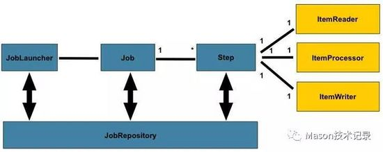

## Spring Batch批处理框架

> Spring Batch不是调度框架

SpringBatch 本身是批处理逻辑的抽象，是对执行任务的规范化，跟调度框架是两回事。它可以结合调度框架，由调度框架进行调度 
SpringBatch 作业，完成对批处理的任务。

> Spring Batch的简单说明

SpringBatch 把批处理简化为 Job 和 Jobstep 两部分，在 Jobstep 中，把数据处理分为读数据(Reader)、处理数据(Processor)、
写数据（Writer）三个步骤，异常处理机制分为跳过、重试、重启三种，作业方式分为多线程、并行、远程、分区四种。开发者在开发过程中，
大部分工作是根据业务要求编写Reader、Processor和Writer即可，提高了批处理开发的效率。同时 SpringBatch 本身也提供了很多默认
的Reader和Writer，开箱即用。

> Spring-Batch组件概念

SpringBatch 在基础架构层，把任务抽象为 Job 和 Step ，一个 Job 由多个 Step 来完成，每个 step 对应一个 ItemReader 、 
ItemProcessor 及 ItemWriter。Job 是通过 JobLauncher 来启动，Job 及 Job 的运行结果和状态、 Step 的运行结果和状态，
都会保存在 JobRepository 中。

- **JobRepository**：作业仓库，保存Job、Step执行过程中的状态及结果
- **JobLauncher**：作业执行器，是执行Job的入口
- **Job**：一个批处理任务，由一个或多个Step组成
- **Step**：一个任务的具体的执行逻辑单位
- **Item**：一条数据记录
- **ItemReader**：从数据源读数据
- **ItemProcessor**：对数据进行处理，如数据清洗、转换、过滤、校验等
- **ItemWriter**：写入数据到指定目标
- **Chunk**：给定数量的Item集合，如读取到chunk数量后，才进行写操作
- **Tasklet**：Step中具体执行逻辑，可重复执行

### 参考文献

1.[数据批处理神器：Spring Batch（一）简介及使用场景](https://www.codercto.com/a/84815.html)
2.[Spring Batch_官网DEMO实现](https://my.oschina.net/xinxingegeya/blog/340302)