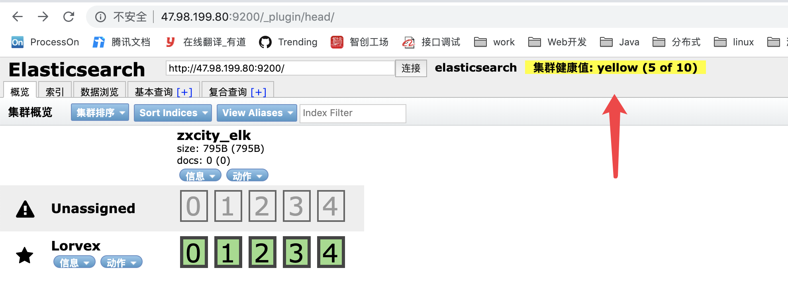

## ElasticSearch 搜索引擎

Elasticsearch是一个基于Lucene构建的开源、分布式、RESTful的搜索引擎，能够实现近实时（NRT）搜索，稳定、可靠、安装方便。
性能不错、水平扩展、文档齐全、社区火爆，这几点很重要。

### 安装和配置

1.安装elasticserach（2.4.6）

```
$ curl -L -O https://download.elastic.co/elasticsearch/release/org/elasticsearch/distribution/tar/elasticsearch/2.4.6/elasticsearch-2.4.6.tar.gz
```

2.新增用户（es为安全考虑不建议使用root账户启动服务）

```
$ groupadd elsearch                   				            // 新建elsearch组
$ useradd elsearch -g elsearch -p topsec  				        // 新建一个elsearch用户
$ chown -R elsearch:elsearch /usr/local/server/elasticsearch/   // 指定elasticsearch所属elsearch组，授权给elsearch的权限为指定目录
```

3.启动/关闭elasticsearch

```
$ su elsearch  		            // 切换用户
$ ./bin/elasticsearch   	    // 前台启动
$ ./bin/elasticsearch -d -p pid	// 后台启动，同时保存pid
$ kill `cat pid`                // 关闭
```

4.配置文件

```
$ vim config/elasticsearch.yml

1）配置外网访问：
  network.host: 0.0.0.0

2）更改数据和日志文件的路径：
  path.data: /path/to/data
  path.logs: /path/to/logs

3）集群名字，用于发现和自动连接其他节点
  cluster.name: my-es-cluster

4）配置节点名
  node.name: node-1
```

5.使用head插件

```
$ su elsearch
$ cd /usr/local/elasticsearch-2.4.6

# 数据查询插件，访问地址：http://192.168.13.140:9200/_plugin/head/  
$ bin/plugin install mobz/elasticsearch-head  
```

6.集群单机多节点配置

node-1 的 elasticsearch.yml:

```yaml
cluster.name: my-es-cluster
node.name: node-1
network.host: 192.168.11.21
http.port: 9200
transport.tcp.port: 9300
discovery.zen.ping.unicast.hosts: ["192.168.11.21:9300","192.168.11.21:9310","192.168.11.21:9320"]
```

node-2 的 elasticsearch.yml:

```yaml
cluster.name: my-es-cluster
node.name: node-2
network.host: 192.168.11.21
http.port: 9210
transport.tcp.port: 9310
discovery.zen.ping.unicast.hosts: ["192.168.11.21:9300","192.168.11.21:9310","192.168.11.21:9320"]
```

node-3 的 elasticsearch.yml:

```yaml
cluster.name: notice-application
node.name: node-3
network.host: 192.168.11.21
http.port: 9220
transport.tcp.port: 9320
discovery.zen.ping.unicast.hosts: ["192.168.11.21:9300","192.168.11.21:9310","192.168.11.21:9320"]
```

其中：

1.Elasticsearch集群中有的节点一般有三种角色:master node、data node和client node。

    master node：master几点主要用于元数据(metadata)的处理，比如索引的新增、删除、分片分配等。

    data node：data 节点上保存了数据分片。它负责数据相关操作，比如分片的 CRUD，以及搜索和整合操作。

    client node：client 节点起到路由请求的作用，实际上可以看做负载均衡器。

2.三个node角色相同，因为节点少于5个 不建议区分node角色 ，Elasticsearch的员工 Christian_Dahlqvist解读如下：
    
    一个节点的缺省配置是：主节点+数据节点两属性为一身。对于3-5个节点的小集群来讲，通常让所有节点存储数据和具有获得主节点的资格。
    你可以将任何请求发送给任何节点，并且由于所有节点都具有集群状态的副本，它们知道如何路由请求。
  
    通常只有较大的集群才能开始分离专用主节点、数据节点。对于许多用户场景，路由节点根本不一定是必需的。
  
    专用协调节点（也称为client节点或路由节点）从数据节点中消除了聚合/查询的请求解析和最终阶段，并允许他们专注于处理数据。

3.节点角色的配置

```
node.master: true
node.data: false

// 配置路由节点地址
discovery.zen.ping.unicast.hosts: ["10.90.4.9"]
discovery.zen.ping.multicast.enabled: true
```

### ElasticSearch基础概念

- Cluster：集群
- Index：索引，Index相当于关系型数据库的DataBase。
- Type：类型，这是索引下的逻辑划分，一般把有共性的文档放到一个类型里面，相当于关系型数据库的table。
- Document：文档，Json结构，这点跟MongoDB差不多。
- Shard、Replica：分片，副本。

分片有两个好处，一个是可以水平扩展，另一个是可以并发提高性能。在网络环境下，可能会有各种导致分片无法正常工作的问题，所以需要有
失败预案。ES支持把分片拷贝出一份或者多份，称为副本分片，简称副本。副本有两个好处，一个是实现高可用（HA，High Availability），
另一个是利用副本提高并发检索性能。

分片和副本的数量可以在创建index的时候指定，index创建之后，只能修改副本数量，不能修改分片。


### [elasticsearch集群生态，分片以及水平扩展](https://www.cnblogs.com/dennisit/p/4133131.html)

elasticsearch用于构建高可用和可扩展的系统。扩展的方式可以是购买更好的服务器(纵向扩展)或者购买更多的服务器（横向扩展）,
Elasticsearch能从更强大的硬件中获得更好的性能，但是纵向扩展也有一定的局限性。真正的扩展应该是横向的，它通过增加节点来传播
负载和增加可靠性。对于大多数数据库而言，横向扩展意味着你的程序将做非常大的改动来利用这些新添加的设备。对比来说，Elasticsearch
天生是分布式的：它知道如何管理节点来提供高扩展和高可用。这意味着你的程序不需要关心这些。对于大多数数据库而言，横向扩展意味着
你的程序将做非常大的改动来利用这些新添加的设备。对比来说，Elasticsearch天生是分布式的：它知道如何管理节点来提供高扩展和高
可用。这意味着你的程序不需要关心这些。

> **集群和节点**

节点(node)是你运行的Elasticsearch实例。一个集群(cluster)是一组具有相同cluster.name的节点集合，他们协同工作，共享数据并
提供故障转移和扩展功能，当有新的节点加入或者删除节点，集群就会感知到并平衡数据。集群中一个节点会被选举为主节点(master),它用
来管理集群中的一些变更，例如新建或删除索引、增加或移除节点等;当然一个节点也可以组成一个集群。

> **节点通信**

我们能够与集群中的任何节点通信，包括主节点。任何一个节点互相知道文档存在于哪个节点上，它们可以转发请求到我们需要数据所在的节点上。
我们通信的节点负责收集各节点返回的数据，最后一起返回给客户端。这一切都由Elasticsearch透明的管理。

> **分片与副本分片**

分片用于Elasticsearch在你的集群中分配数据。想象把分片当作数据的容器。文档存储在分片中，然后分片分配给你集群中的节点上。当你的
集群扩容或缩小，Elasticsearch将会自动在你的节点间迁移分片，以使集群保持平衡。

一个分片(shard)是一个最小级别的“工作单元(worker unit)”,它只是保存索引中所有数据的一小片.我们的文档存储和被索引在分片中，但是
我们的程序不知道如何直接与它们通信。取而代之的是，他们直接与索引通信.Elasticsearch中的分片分为主分片和副本分片,复制分片只是主
分片的一个副本，它用于提供数据的冗余副本，在硬件故障之后提供数据保护，同时服务于像搜索和检索等只读请求，主分片的数量和复制分片的
数量都可以通过配置文件配置。但是主切片的数量只能在创建索引时定义且不能修改，相同的分片不会放在同一个节点上。

**1）分片算法:**

shard = hash(routing) % number_of_primary_shards

routing值是一个任意字符串，它默认是 _id 但也可以自定义，这个routing字符串通过哈希函数生成一个数字，然后除以主切片的数量得到一个
余数(remainder)，余数的范围永远是 0 到number_of_primary_shards - 1，这个数字就是特定文档所在的分片。

这也解释了为什么主切片的数量只能在创建索引时定义且不能修改：如果主切片的数量在未来改变了，所有先前的路由值就失效了，文档也就永远
找不到了。

所有的文档API（get、index、delete、bulk、update、mget）都接收一个routing参数，它用来自定义文档到分片的映射。自定义路由值可
以确保所有相关文档.比如用户的文章,按照用户账号路由,就可以实现属于同一用户的文档被保存在同一分片上。

**2）分片和副本交互：**

新建、索引和删除请求都是写(write)操作，它们必须在主分片上成功完成才能复制到相关的复制分片上,下面我们罗列在主分片和复制分片上成功
新建、索引或删除一个文档必要的顺序步骤：

1、客户端给Node-1发送新建、索引或删除请求。

2、节点使用文档的_id确定文档属于分片0。它转发请求到Node-3，分片0位于这个节点上。

3、Node-3在主分片上执行请求，如果成功，它转发请求到相应的位于Node-1和Node-2的复制节点上。当所有的复制节点报告成功，Node-3报告
成功到请求的节点，请求的节点再报告给客户端。

客户端接收到成功响应的时候，文档的修改已经被应用于主分片和所有的复制分片。你的修改生效了。

**3)副本分片复制时的相关的参数说明:**

- replication:

复制默认的值是sync。这将导致主分片得到复制分片的成功响应后才返回，如果你设置replication为async，请求在主分片上被执行后就会返回
给客户端。它依旧会转发请求给复制节点，但你将不知道复制节点成功与否。

默认的sync复制允许Elasticsearch强制反馈传输。async复制可能会因为在不等待其它分片就绪的情况下发送过多的请求而使Elasticsearch过载。

- consistency:

默认主分片在尝试写入时需要**规定数量(quorum)**或过半的分片（可以是主节点或复制节点）可用。这是防止数据被写入到错的网络分区。规定
的数量计算公式如下：`int( (primary + number_of_replicas) / 2 ) + 1`

consistency允许的值为one（只有一个主分片），all（所有主分片和复制分片）或者默认的quorum或过半分片。

注意number_of_replicas是在索引中的的设置，用来定义复制分片的数量，而不是现在活动的复制节点的数量。如果你定义了索引有3个复制节点，
那规定数量是：`int( (primary + 3 replicas) / 2 ) + 1 = 3`

但如果你只有2个节点，那你的活动分片不够规定数量，也就不能索引或删除任何文档。

注意: 新索引默认有1个复制分片，这意味着为了满足quorum的要求**需要**两个活动的分片。当然，这个默认设置将阻止我们在单一节点集群中进
行操作。为了避开这个问题，规定数量只有在number_of_replicas大于一时才生效。

- timeout：

当分片副本不足时Elasticsearch会等待更多的分片出现。默认等待一分钟。如果需要，你可以设置timeout参数让它终止的更早：100表示100毫秒，
30s表示30秒。


> **集群生态**

1.同集群中节点之间可以扩容缩容。

2.主分片的数量会在其索引创建完成后修正，但是副本分片的数量会随时变化。

3.相同的分片不会放在同一个节点上。


> **集群健康值**

在Elasticsearch集群中可以监控统计很多信息，但是只有一个是最重要的时集群健康(cluster health)。Es中用三种颜色状态表示:green，yellow，red.

Green：所有主分片和副本分片都可用

Yellow：所有主分片可用，但不是所有副本分片都可用

Red：不是所有的主分片都可用



