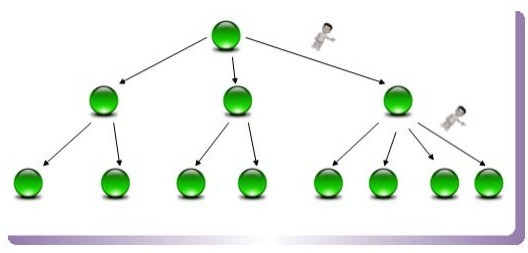

## Lucene 全文搜索引擎

- Lucene是一套用于全文检索和搜寻的开源程序库，由Apache软件基金会支持和提供
- Lucene提供了一个简单却强大的应用程序接口（API），能够做全文索引和搜寻，在Java开发环境里Lucene是一个成熟的免费开放源代码工具
- Lucene并不是现成的搜索引擎产品，但可以用来制作搜索引擎产品
- 官网：http://lucene.apache.org/

**全文索引**

- 计算机索引程序通过扫描文章中的每一个词，对每一个词建议一个索引，指明该词在文章中出现的次数和位置，当用户查询时，检索程序就根据
  事先建立的索引进行查找，并将查找的结果返回给用户的检索方式。
  
- Lucene全文索引就是对文档中全部内容进行分词，然后对所有单词建立倒排索引的过程。

**Lucene、Solr、Elasticsearch关系**

- Lucene：底层的API，工具包
- Solr：基于Lucene开发的企业级的搜索引擎产品
- Elasticsearch：基于Lucene开发的企业级的搜索引擎产品


### 倒排索引

> **什么是正向索引、什么是倒排索引？**

正向索引（forward index），反向索引（inverted index）更熟悉的名字是倒排索引。

在`搜索引擎`中每个文件都对应一个文件ID，文件内容被表示为一系列关键词的集合（实际上在搜索引擎索引库中，关键词也已经转换为关键词ID）。
例如“文档1”经过分词，提取了20个关键词，每个关键词都会记录它在文档中的出现次数和出现位置。

得到`正向索引`的结构如下：

```
“文档1”的ID > 单词1：出现次数，出现位置列表；单词2：出现次数，出现位置列表；…………。

“文档2”的ID > 此文档出现的关键词列表。
```

当用户在主页上搜索关键词“华为手机”时，假设只存在正向索引（forward index），那么就需要扫描索引库中的所有文档，找出所有包含关键词
“华为手机”的文档，再根据打分模型进行打分，排出名次后呈现给用户。因为互联网上收录在搜索引擎中的文档的数目是个天文数字，这样的索引
结构根本无法满足实时返回排名结果的要求。

所以，搜索引擎会将正向索引重新构建为倒排索引，即把文件ID对应到关键词的映射转换为`关键词到文件ID的映射`，每个关键词都对应着一系列的文件，
这些文件中都出现这个关键词。

得到`倒排索引`的结构如下：

```
“关键词1”：“文档1”的ID，“文档2”的ID，…………。

“关键词2”：带有此关键词的文档ID列表。
```

> **单词——文档矩阵**

单词-文档矩阵是表达两者之间所具有的一种包含关系的概念模型，图1展示了其含义。图1 的`每列代表一个文档，每行代表一个单词`，打对勾的位置代表包含关系。


从纵向即文档这个维度来看，每列代表文档包含了哪些单词，比如文档1包含了词汇1和词汇4，而不包含其它单词。从横向即单词这个维度来看，
每行代表了哪些文档包含了某个单词。

搜索引擎的索引其实就是实现“单词-文档矩阵”的具体`数据结构`。可以有不同的方式来实现上述概念模型，比如“倒排索引”、“签名文件”、“后缀树”等方式。
但是各项实验数据表明，“倒排索引”是实现单词到文档映射关系的最佳实现方式。


> **倒排索引基本概念**

- **文档(Document)**：一般搜索引擎的处理对象是互联网网页，而文档这个概念要更宽泛些，代表以文本形式存在的存储对象。

- **文档集合(Document Collection)**：由若干文档构成的集合称之为文档集合。

- **文档编号(Document ID)**：在搜索引擎内部，会将文档集合内每个文档赋予一个唯一的内部编号，以此编号来作为这个文档的唯一标识。

- **单词编号(Word ID)**：与文档编号类似，搜索引擎内部以唯一的编号来表征某个单词，单词编号可以作为某个单词的唯一表征。

- **倒排索引(Inverted Index)**：倒排索引是实现“单词-文档矩阵”的一种具体存储形式，通过倒排索引，可以根据单词快速获取包含这个单词的
文档列表。倒排索引主要由两个部分组成：“单词词典”和“倒排文件”。

- **单词词典(Lexicon)**：搜索引擎的通常索引单位是单词，单词词典是由文档集合中出现过的所有单词构成的字符串集合，单词词典内每条索引项
记载单词本身的一些信息以及指向“倒排列表”的指针。

- **倒排列表(PostingList)**：倒排列表记载了出现过某个单词的所有文档的文档列表及单词在该文档中出现的位置信息，每条记录称为一个
倒排项(Posting)。根据倒排列表，即可获知哪些文档包含某个单词。

- **倒排文件(Inverted File)**：所有单词的倒排列表往往顺序地存储在磁盘的某个文件里，这个文件即被称之为倒排文件，倒排文件是存储倒排索引的物理文件。


> **单词字典**

单词词典是倒排索引中非常重要的组成部分，它用来维护文档集合中出现过的所有单词的相关信息，同时用来记载某个单词对应的倒排列表在倒排文件
中的位置信息。在支持搜索时，根据用户的查询词，去单词词典里查询，就能够获得相应的倒排列表，并以此作为后续排序的基础。

对于一个规模很大的文档集合来说，可能包含几十万甚至上百万的不同单词，能否快速定位某个单词，这直接影响搜索时的响应速度，所以需要高效的
数据结构来对单词词典进行构建和查找，常用的数据结构包括哈希加链表结构和树形词典结构。

**哈希加链表**

图1-7 是这种词典结构的示意图。这种词典结构主要由两个部分构成：

主体部分是哈希表，每个哈希表项保存一个指针，指针指向冲突链表，在冲突链表里，相同哈希值的单词形成链表结构。之所以会有冲突链表，是因为
两个不同单词获得相同的哈希值，如果是这样，在哈希方法里被称做是一次冲突，可以将相同哈希值的单词存储在链表里，以供后续查找。


在建立索引的过程中，词典结构也会相应地被构建出来。比如在解析一个新文档的时候，对于某个在文档中出现的`单词T`，首先利用哈希函数获得其
哈希值，之后根据哈希值对应的哈希表项读取其中保存的指针，就找到了对应的`冲突链表`。如果冲突链表里已经存在这个单词，说明单词在之前解析
的文档里已经出现过。如果在冲突链表里没有发现这个单词，说明该单词是首次碰到，则将其加入冲突链表里。通过这种方式，当文档集合内所有文档
解析完毕时，相应的词典结构也就建立起来了。

在响应用户查询请求时，其过程与建立词典类似，不同点在于即使词典里没出现过某个单词，也不会添加到词典内。以图1-7为例，假设用户输入的查询
请求为单词3，对这个单词进行哈希，定位到哈希表内的2号槽，从其保留的指针可以获得冲突链表，依次将单词3和冲突链表内的单词比较，发现单词3
在冲突链表内，于是找到这个单词，之后可以读出这个单词对应的倒排列表来进行后续的工作，如果没有找到这个单词，说明文档集合内没有任何文档
包含单词，则搜索结果为空。

**树形结构**

B树（或者B+树）是另外一种高效查找结构，图8是一个 B树结构示意图。B树与哈希方式查找不同，需要字典项能够按照大小排序（数字或者字符序），
而哈希方式则无须数据满足此项要求。

B树形成了层级查找结构，中间节点用于指出一定顺序范围的词典项目存储在哪个子树中，起到根据词典项比较大小进行导航的作用，最底层的叶子节点
存储单词的地址信息，根据这个地址就可以提取出单词字符串。




> **倒排索引简单示例**


其中：

- 单词ID：记录每个单词的单词编号；
- 单词：对应的单词；
- 文档频率：代表文档集合中有多少个文档包含某个单词
- 倒排列表：包含单词ID及其他必要信息
- DocId：单词出现的文档id
- TF：单词在某个文档中出现的次数
- POS：单词在文档中出现的位置

以单词“加盟”为例，其单词编号为6，文档频率为3，代表整个文档集合中有三个文档包含这个单词，对应的倒排列表为{(2;1;<4>),(3;1;<7>),(5;1;<5>)}，
含义是在文档2，3，5出现过这个单词，在每个文档的出现过1次，单词“加盟”在第一个文档的POS是4，即文档的第四个单词是“加盟”，其他的类似。
这个倒排索引已经是一个非常完备的索引系统，实际搜索系统的索引结构基本如此。


### Lucene的基本使用

> **1.创建索引**

```
1 创建文档对象
2 创建存储目录
3 创建分词器
4 创建索引写入器的配置对象
5 创建索引写入器对象
6 将文档交给索引写入器
7 提交
8 关闭
```

> **2.查询索引数据**

```
1 创建读取目录对象
2 创建索引读取工具
3 创建索引搜索工具
4 创建查询解析器
5 创建查询对象
6 搜索数据
7 各种操作
```


