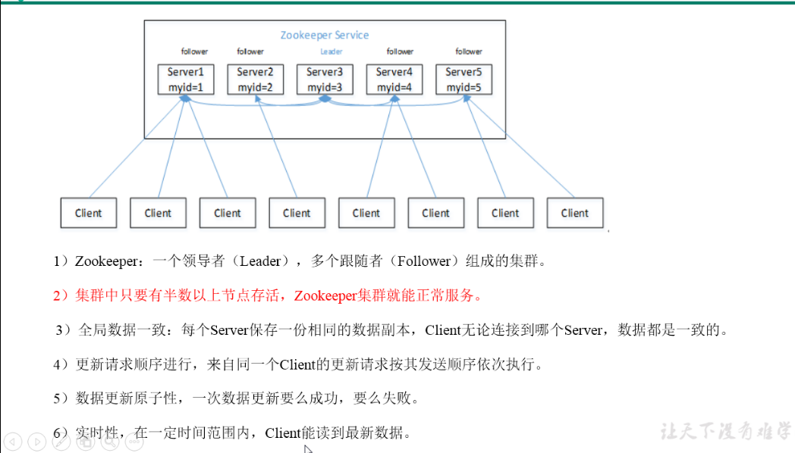

## Zookeeper介绍

Apache Zookeeper是由Apache Hadoop的子项目发展而来的。Zookeeper为分布式应用提供了高效且可靠的分布式协调服务，提供了诸如统一
命名服务、配置管理和分布式锁等分布式的基础服务。在解决分布式数据一致性方面，Zookeeper没有直接采用Paxos算法，而是采用了一种被称为
ZAB（Zookeeper Atomic Broadcast）的一致性协议。

    Zookeeper是一个典型的分布式数据一致性的解决方案，分布式应用程序可以基于它实现诸如数据发布/订阅、负载均衡、命名服务、分布式协调/通
    知、集群管理、Master选举、分布式锁和分布式队列等功能。Zookeeper可以保证如下分布式一致性特性：
    1.顺序一致性：
      从同一个客户端发起的事务请求，最终将会严格地按照其发起的顺序应用到Zookeeper中去。
    2.原子性：
      所有事务请求的处理结果在整个集群中所有机器上的应用情况是一致的，也就是说要么整个集群所有机器都成功应用了某一个事务，要么都没有应用，
      一定不会出现集群中部分机器应用了该事务，而另一部分没有应用的情况。
    3.单一视图：
      无论客户端连接的是哪个Zookeeper服务器，其看到的服务端数据模型都是一致的。
    4.可靠性
      一旦服务器成功地应用了一个事务，并完成对客户端的响应，那么该事务所引起的服务端状态变更将会被一直保留下来，除非有另一个事务又对其进行了变更。
    5.实时性
      通常人们看到实时性的第一反应是，一旦一个事务被成功应用，那么客户端能够立即从服务端上读取到这个事务变更后的最新数据状态。这里需要
      注意的是，Zookeeper仅仅保证在一定的时间段内，客户端最终一定能够从服务端上读取到最新的数据状态。

### Zookeeper典型应用场景

    1.数据发布/订阅
      发布者将数据发布到Zookeeper的一个或一系列节点上，供订阅者进行数据订阅，进而达到动态获取数据的目的，实现配置信息的集中式管理和数
      据的动态更新。
    
      发布/订阅系统一般有两种设计模式，分别是推（Push）模式和拉（Pull）模式。在推模式中，服务端主动将数据更新发送给所有订阅的客户端；
      而拉模式则是由客户端主动发起请求来获取最新数据，通常客户端都采用定时进行轮询拉取的方式。Zookeeper采用的是推拉相结合的方式：客户
      端向服务端注册自己需要关注的节点，一旦节点的数据发生变更，那么服务端就会向相应的客户端发送 Watch 事件通知，客户端收到这个消息通
      知之后，需要主动到服务端获取最新的数据。
    2.负载均衡
    3.命名服务
      命名服务（Name Service）是分布式系统中最基本的公共服务之一。在分布式系统中，被命名的实体通常可以是集群中的机器、提供的服务地址
      或远程对象等，其中比较常见的就是一些分布式服务框架（如RPC）中的服务地址列表，通过使用命名服务，客户端应用能够根据指定名字来获取资
      源的实体、服务地址和提供者的信息等。
    4.分布式协调/通知
      对于一个在多台机器上部署运行的应用而言，通常需要一个协调者（Coordinator）来控制这个系统的运行流程，例如分布式事务的处理、机器间
      的互相协调等。同时，引入这样一个协调者，便于将分布式协调的职责从应用中分离出来，从而可以大大减少系统之间的耦合性，而且能够显著提高
      系统的可扩展性。
    5.集群管理
      所谓集群管理，包括集群监控与集群控制两大块，前者侧重对集群运行时状态的收集，后者则是对集群进行操作与控制。
    6.Master选举
    7.分布式锁
    8.分布式队列

### ZooKeeper架构

1.集群图表：

2.组件介绍：

- Client（客户端）：
分布式应用集群中的一个节点，从服务器访问信息。对于特定的时间间隔，每个客户端向服务器发送消息以使服务器知道客户端是活跃的。类似地，当客户端
连接时，服务器发送确认码。如果连接的服务器没有响应，客户端会自动将消息重定向到另一个服务器。

- Server（服务器）：
ZooKeeper总体中的一个节点，为客户端提供所有的服务。向客户端发送确认码以告知服务器是活跃的。

- Ensemble：
ZooKeeper服务器组。形成ensemble所需的最小节点数为3。

- Leader：
服务器节点，如果任何连接的节点失败，则执行自动恢复。Leader在服务启动时被选举。

- Follower：
跟随leader指令的服务器节点。

### Zookeeper的特点
    1.一个领导者（Leader），多个跟随着（Follower）组成的集群。
    2.集群中只要有半数以上的节点存活，zookeeper就能正常服务。
    3.全局数据一致：每个server保存一份相同的数据副本，Client无论连接到哪个server，数据都是一致的。
    4.更新请求顺序执行，来自同一个client的更新请求按其发送顺序依次执行。
    5.数据更新原子性，一次数据更新要么成功，要么失败。
    6.实时性，在一定时间范围内，Client能读到最新的数据。

### 集群选举机制
    1.半数机制：集群中半数以上机器存活，集群可用。所以Zookeeper适合安装奇数台服务器。
    2.Zookeeper虽然在配置文件中并没有指定Master和Slave。但是，Zookeeper工作时，是有一个节点为Leader，其他则为Follower，Leader
      是通过内部的选举机制临时产生的。
    3.选举的过程：
      1）服务器1启动，此时只有它一台服务器启动了，它发出去的报文没有任何响应，所以它的选举状态一直是LOOKING状态。
      2）服务器2启动，它与最开始启动的服务器1进行通信，互相交换自己的选举结果，由于两者都没有历史数据，所以id值较大的服务器2胜出，但是
         由于没有达到超过半数以上的服务器都同意选举它(这个例子中的半数以上是3)，所以服务器1、2还是继续保持LOOKING状态。
      3）服务器3启动，根据前面的理论分析，服务器3成为服务器1、2、3中的老大，而与上面不同的是，此时有三台服务器选举了它，所以它成为了这
         次选举的Leader。
      4）服务器4启动，根据前面的分析，理论上服务器4应该是服务器1、2、3、4中最大的，但是由于前面已经有半数以上的服务器选举了服务器3，所
         以它只能接收当小弟的命了。

### 写数据流程
    1.Client向Server1 上写数据，发送一个写请求。
    2.如果Server1不是Leader，那么Server1会把接受到的请求进一步转发给Leader。这个Leader会将写请求广播给各个Server，各Server写成
      功后就会通知Leader。
    3.当Leader收到大多数Server数据写成功了，那么就说明数据写成功了。如果这里三个节点的话，只要两个节点写成功了，那么就认为数据写成功了。
      写成功之后，Leader就会告诉Server1数据写成功。
    4.Server1会进一步通知Client数据写成功了，那么整个过程写操作成功了。

### 集群角色
    Zookeeper没有沿用传统的Master/Slave概念，而是引入了Leader、Follower和Observer三种角色。Zookeeper集群中的所有机器通过一个
    Leader选举过程来选定一台称为”Leader“的机器，Leader服务器为客户端提供读和写服务。除Leader外，其它机器包括Follower和Observer。
    Follower和Observer都能够提供读服务，唯一的区别在于，Observer机器不参与Leader选举过程，也不参与写操作的”过半写成功“策略，因此
    Observer可以在不影响写性能的情况下提升集群的读写性能。

### 会话（Session)
    Session是指客户端会话，客户端启动时，会与服务端建立一个TCP连接，从第一次连接建立开始，客户端会话的生命周期也开始了，通过这个连接，
    客户端能够通过心跳检测与服务器保持有效的会话，也能够向Zookeeper服务器发送请求并接受响应，同时还能够通过该连接接收来自服务器的Watch
    事件通知。Session的sessionTimeout值用来设置一个客户端会话的超时时间。当由于服务器压力太大、网络故障或是客户端主动断开连接等各种
    原因导致客户端连接断开时，只要在sessionTimeout规定的时间内重新连接上集群中任意一台机器，那么之前创建的会话仍然有效。

### 数据节点（ZNode）
    在Zookeeper中，“节点”分为两类，第一类同样是指构成集群的机器，我们称之为机器节点；第二类则是指数据模型中的数据单元，我们称之为数据
    节点——ZNode。Zookeeper将所有数据存储在内存中，数据模型是一棵树（ZNode Tree），由斜杠进行分割的路径就是一个ZNode。每个ZNode上
    都会保存自己的数据内容，同时还会保存一系列属性信息。

### 版本
    每个ZNode，Zookeeper都会为其维护一个叫做Stat的数据结构，Stat中记录了这个ZNode的三个数据版本，分别是cversion(子节点版本号，子
    节点每次修改版本号加1）、dataversion（数据版本号，数据每次修改该版本号加1）、aclversion（权限版本号，权限每次修改该版本号加1）

### Watcher
    Watch（事件监听器），Zookeeper允许用户在指定的节点上注册一些Watcher，并且在一些特定事件触发的时候，Zookeeper服务端会将事件通知
    到感兴趣的客户端上去。

### ACL
    Zookeeper采用ACL（Access Control Lists）策略来进行权限控制，类似于Unix系统的权限控制。Zookeeper定义了如下5种权限：
    - CREATE：创建子节点的权限
    - READ：获取节点数据和子节点列表的权限
    - WRITE：更新节点数据的权限
    - DELETE：删除子节点的权限
    - ADMIN：设置节点ACL的权限

### Stat数据体
    指ZNode数据节点的状态信息：
    - cZxid：创建节点时的事务ID
    - ctime：创建节点时的时间
    - mZxid：最后修改节点时的事务ID
    - mtime：最后修改节点时的时间
    - pZxid：表示该节点的子节点列表最后一次修改的事务ID，添加子节点或删除子节点就会影响子节点列表，但是修改子节点的数据内容则不影响该ID
    - cversion：子节点版本号，子节点每次修改版本号加1
    - dataversion：数据版本号，数据每次修改该版本号加1
    - aclversion：权限版本号，权限每次修改该版本号加1
    - dataLength：该节点的数据长度
    - numChildren：该节点拥有子节点的数量

### Zookeeper数据结构
    1.zookeeper数据模型的结构与unix文件系统很类似，这个存储结构是一个树形结构，其上的每个节点称做一个znode，和文件系统一样，可以自由
      增加及删除，唯一不同其可存储数据，每个znode默认能够存储1MB的数据，每个znode都可以通过其路径唯一标识。
    2.每个子目录项如 NameService 都被称作为 znode，和文件系统一样，自由增加及删除，唯一不同其可存储数据。
    3.Znode的类型
      PERSISTENT：持久化目录节点（客户端与zookeeper断开连接后，该节点依旧存在）
      EPHEMERAL：临时目录节点（客户端与zookeeper断开连接后，该节点被删除）
      PERSISTENT_SEQUENTIAL：持久化顺序编号目录节点（客户端与zookeeper断开连接后，该节点依旧存在，只是Zookeeper给该节点名称进行顺序编号）
      EPHEMERAL_SEQUENTIAL：临时顺序编号目录节点（客户端与zookeeper断开连接后，该节点被删除，只是Zookeeper给该节点名称进行顺序编号）

### ZooKeeper常见服务
    1.命名服务：在zookeeper的数据文件系统里创建一个目录，对应唯一的path
    2.配置管理：程序总是需要配置的，如果程序分散部署在多台机器上，要逐个改变配置就变得困难。现在把这些配置全部放到zookeeper上去，保存在
      Zookeeper 的某个目录节点中，然后所有相关应用程序对这个目录节点进行监听，一旦配置信息发生变化，每个应用程序就会收到 Zookeeper的
      通知，然后从 Zookeeper 获取新的配置信息应用到系统中就好。
    3.集群管理：实时地在集群和节点状态中加入/离开节点。
    4.选举算法：选举一个节点作为协调目的的leader。
    5.锁定和同步服务：在修改数据的同时锁定数据。此机制可帮助你在连接其他分布式应用程序（如Apache HBase）时进行自动故障恢复。
    6.高度可靠的数据注册表：即使在一个或几个节点关闭时也可以获得数据。

### Zookeeper 的读写机制
    1.Zookeeper是一个leader，多个follower组成的集群
    2.全局数据一致，每个server保存一份相同的数据副本，client无论连接到哪个server数据都是一致。
    3.数据更新原子性，一次数据更新要么成功，要么失败。
    4.更新请求顺序执行，来自同一个client的更新请求按其发送顺序依次执行。
    5.实时性：在一定时间范围内，client能读到最新数据。
    6.更新请求转发，由leader实施

### Zookeeper节点数据操作流程
    1.在Client向Follwer-1发出一个写的请求
    2.Follwer-1把请求发送给Leader
    3.Leader接收到请求以后向所有的Follwer发出写入请求
    4.Follwer把写入结果发送给Leader
    5.当Leader收到大部分Follwer写成功的消息，那么说明数据写成功，leader会告诉Follwer-1数据写成功。
    6.Follwer-1把请求结果返回给Client

### 服务端命令
    1. 启动ZK服务:       $ bin/zkServer.sh start
    2. 查看ZK服务状态:   $ bin/zkServer.sh status
    3. 停止ZK服务:       $ bin/zkServer.sh stop
    4. 重启ZK服务:       $ bin/zkServer.sh restart

### 配置参数解读（zoo.cfg）
    tickTime =2000：通信心跳数，Zookeeper服务器与客户端心跳时间，单位毫秒
    initLimit =10：集群中的Follower跟随者服务器与Leader领导者服务器之间初始连接时能容忍的最多心跳数（tickTime的数量），用它来限
                  定集群中的Zookeeper服务器连接到Leader的时限。
    syncLimit =5：集群中Leader与Follower之间的最大响应时间单位，假如响应超过syncLimit * tickTime，Leader认为Follwer死掉，
                  从服务器列表中删除Follwer。
    dataDir=/tmp/zookeeper：数据文件目录+数据持久化路径
    clientPort =2181：客户端连接端口

### 客户端命令
    启动客户端: bin/zkCli.sh -server 127.0.0.1:2181
    1.创建节点且写入数据：
       $ create [-s] [-e] path data acl
       其中，-s或-e分别指定节点特性：顺序或临时节点；最后一个参数是acl，它是用来进行权限控制的，缺省情况下，不做任何权限控制。
       $ create /test "hello"			# 持久节点
       $ create -e /test "hello"		# 临时节点
       $ create -s /test "hello"		# 持久的序号节点（序号自增）
    2.查看指定节点下所有的子节点：
       $ ls path [watch]
    3.获取指定节点的数据和属性信息：
       $ get path [watch]
    4.更新指定节点的数据内容：
       $ set path data [version]
       其中，version参数用于指定本次更新操作是基于ZNode的哪一个版本进行的。version参数正是由CAS原理衍化而来。
    5.删除指定节点：
       $ delete path [version]
       其中，version参数用于指定本次删除操作是基于ZNode的哪一个版本进行的。要想删除某一个节点，该节点必须没有子节点存在。
       $ rmr /test   				# 递归删除节点：
    6.其它命令：
       $ stat /test 				# 查看节点状态
       $ quit					# 退出客户端

### 节点权限
    ACL全称为Access Control List（访问控制列表），用于控制对ZNode的访问权限。如节点数据读写、节点创建、节点删除、读取子节点列表、
    设置节点权限等。znode的ACL是没有继承关系的，每个znode的权限都是独立控制的，只有客户端满足znode设置的权限要求时，才能完成相应的
    操作。Zookeeper的ACL，分为三个维度：scheme、id、permission，通常表示为：scheme:id:permission，其中：schema代表授权策略，
    id代表用户，permission代表权限。下面分别讲述一下这三个属性：
    1）scheme（授权策略），每种授权策略对应不同的权限校验方式，下面是zk常用的几种scheme：
       world：默认方式，相当于全世界都能访问
       auth：不使用任何id，表示任何经过身份验证的用户。
       digest：即用户名:密码这种方式认证，这也是业务系统中最常用的,使用username:password字符串生成MD5哈希，然后将其用作ACL的ID标识。
       ip：使用Ip地址认证
    2）id（验证模式）
       不同的scheme，id的值也不一样。scheme为digest时，id的值为：username:BASE64(SHA1(password))，scheme为ip时，id的值为
       客户端的ip地址。scheme为world时，id的值为anyone。scheme为auth时,id为 username:password。
    3）permission
       digest:username:BASE64(SHA1(password)):cdrwa中的cdrwa即是permission。
