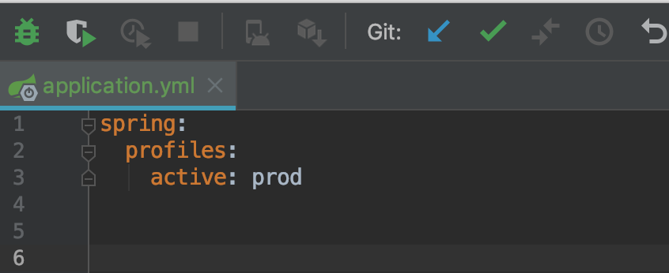
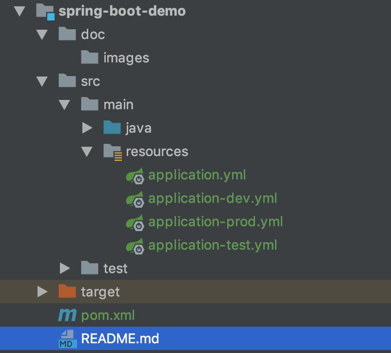

## Spring-Boot项目基础
#### 1.在application.yml中指定配置文件：


#### 2.运行Spring-Boot.jar时指定环境
```
java -jar spring-boot-demo-1.0.0.SNAPSHOT.jar --spring.profiles.active=prod
```


#### 3.通过命令行选项参数转换为配置信息：
```
java -jar spring-boot-demo-1.0.0.SNAPSHOT.jar --server.port=9000
```
